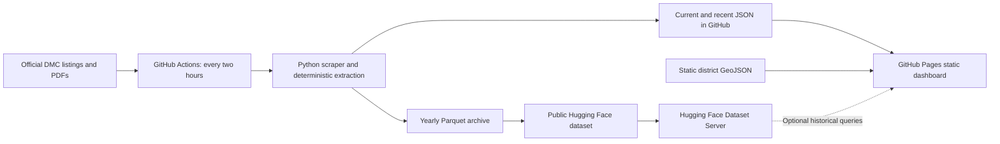

# Sri Lanka Disaster Monitor

[Dashboard](https://gajarthan.github.io/sl-disaster-monitor/) · [Public dataset](https://huggingface.co/datasets/gajarthan/sl-disaster-alerts) · [Pipeline runs](https://github.com/Gajarthan/sl-disaster-monitor/actions/workflows/scrape.yml)

An independent, lightweight way to find official Sri Lankan disaster reports by district, hazard, language and date. It collects the Disaster Management Centre's public listings, extracts linked PDFs locally, and publishes source-linked records. **This is not an official DMC service, an emergency alert service, or a substitute for government instructions.**

Source: **Disaster Management Centre, Sri Lanka**. Every report links prominently to its original DMC PDF. A district match means the district was mentioned in a document, not that the whole district is affected. No report, no text, or unavailable data must never be interpreted as an all-clear.

## Architecture



Only GitHub and Hugging Face provide runtime infrastructure. There is no backend, database server, paid model API, paid map API, or cloud compute account to provision. Leaflet and district geometry are served locally by Pages; the map needs no third-party tile service. Standard public GitHub Actions and public Hugging Face hosting are used within their free service limits. Availability, scheduling and quotas remain subject to the providers.

## Supported sources

| DMC category | `document_type` | `report_type_id` | Menu ID |
|---|---|---:|---:|
| Situation Reports | `situation` | 1 | 273 |
| Weather Forecasts and Advisories | `weather` | 2 | 274 |
| Landslide Warnings | `landslide` | 5 | 276 |
| River Water Level and Flood Warnings | `river_flood` | 6 | 277 |

The scraper uses DMC's `/index.php?option=com_dmcreports&view=reports` listings with **both** the menu ID and report type. A menu ID alone can return mixed categories. It follows observed pagination offsets while retaining the category filter. Initial collection covers at least seven recent days within the page budget, plus older records on each category's boundary page. It does not claim a complete historical backfill.

This project has its own scraper, normalization rules and storage implementation. It does not depend on `nuuuwan/lk_dmc`.

## Local development

Requires Python 3.11+ and Node.js 22+ for frontend tests. No frontend build framework or package installation is needed.

```sh
git clone https://github.com/Gajarthan/sl-disaster-monitor.git
cd sl-disaster-monitor
python -m venv .venv
# Linux/macOS: source .venv/bin/activate
# Windows PowerShell: .venv\Scripts\Activate.ps1
python -m pip install -r requirements.txt
python -m pytest -q
node --test tests/frontend.test.mjs

# Collect DMC documents and atomically write JSON, Parquet, state and health.
python -m scraper.pipeline
python -m huggingface.build_dataset --validate

# Build only the public static assets, then serve them locally.
python scripts/build_site.py
python -m http.server 8000 --directory build/site
```

Open `http://localhost:8000`. Use HTTP rather than opening `index.html` directly, because browser modules and fetch need an HTTP origin. The checked-in real data allows local dashboard development without contacting DMC.

## Collection, processing and reliability

1. Fetch each category with bounded timeouts, retries and a descriptive User-Agent. Listing/redirect URLs must remain on the official DMC HTTPS host.
2. Validate table shape, dates, times and PDF links. A missing or empty table is a collection error, never an empty alert result.
3. Stop at the configured recent-date boundary or an already-known page after checking a second page. Repeated pages and exhausted page budgets produce an incomplete status.
4. Skip known URLs; hash downloaded PDF bytes with SHA-256. The stable record ID is `dmc-<full SHA-256>`. Identical PDFs at different URLs produce one record, with source listing occurrences retained under `official.listings`.
5. Download at most 20 MB per PDF into a temporary directory, extract text, normalize and validate. Temporary PDFs are automatically removed. Malformed/encrypted/oversized PDFs fail explicitly. Empty extracted text produces a source-linked `no_text` record with `unknown` language.
6. Persist download/parse failures in `state/pending.json` and retry them even after they leave the current listing window. Write archive files before committing successful processing state.
7. Merge successful records, regenerate current/recent JSON, and publish health. On total listing outage the previous feeds stay intact. `last_successful_scrape` only advances when all categories and pending document downloads/parses succeed.

```sh
# Detect a source replacing a PDF at an existing URL (also scheduled daily).
python -m scraper.pipeline --recheck

# Re-run extraction after parser/rule changes, including unchanged hashes.
python -m scraper.pipeline --reprocess

# Upgrade language labels/evidence for the entire existing archive only.
# Checks each PDF's hash and preserves other fields; safe to resume after failure.
python -m scraper.reprocess_languages

# Expand collection/backfill deliberately; the page budget stays bounded.
python -m scraper.pipeline --bootstrap-days 30 --max-pages 50 --reprocess
```

Large backfills should be run in measured batches to avoid burdening DMC. Rule changes do not automatically rewrite all historical data. Reprocessing applies to the configured discovery window; widen it deliberately for older records. A replaced PDF at the same URL receives a new content ID and leaves the earlier version in history.

## Data contract

| Field group | Meaning |
|---|---|
| `official` | Verbatim cleaned listing title, description if supplied, date/time, category and source URLs. `listings` preserves additional occurrences. |
| `id`, `content_hash`, `source_pdf` | Content identity and official original document link. |
| `issued_at` | Listing date/time interpreted as Sri Lanka time, `+05:30`. Null if time is missing; no invented midnight. |
| `language`, `languages_detected`, confidence/reason | All supported languages detected by page/script and English word evidence. `language=mul` denotes multiple languages; the list retains `en`, `si`, `ta`. Unrecognized/insufficient text remains `unknown`. |
| `hazard`, `hazards` | Deterministic keyword matches across title/body; primary hazard favors title evidence. |
| `severity` | Explicit listing-title label only: `info`, `advisory`, `warning`, `severe`, or `unknown`. An advisory for severe lightning stays advisory. |
| `districts`, `provinces` | Multilingual dictionary mentions, with province derived from a named district or explicitly mentioned province. Province-only text does not invent districts. |
| `summary` | First 600 characters of extracted PDF text, visibly labeled as an automatic excerpt. |
| `valid_from`, `valid_until` | Null in this MVP; no guessed active/expiry interval. |
| `extraction` | Rule version, status, severity evidence and scope/validity limitations. |

The versioned [JSON schema](schemas/alert.schema.json) rejects invalid severities, source URLs and malformed records. Additional district attributes can later represent DS/GN divisions, towns, rivers, reservoirs, coastlines or coordinates without changing how documents are acquired.

A PDF with Sinhala and English pages now has `"language": "mul"` and `"languages_detected": ["en", "si"]`. Each original page retains its own language list, evidence, reason and heuristic confidence under `extraction.language_detection.pages`. The language filter matches membership, so that report appears under both English and Sinhala, as well as Multilingual. A small foreign-language heading alone is insufficient evidence; mixed pages require substantial script/word evidence. These labels describe text present in the PDF, not the completeness of translations.

Hazards: `heavy_rain`, `flood`, `river_flood`, `landslide`, `lightning`, `strong_wind`, `high_waves`, `rough_sea`, `cyclone`, `drought`, `general_weather`, `other`. Classification is a search aid: a water-level report can receive the `river_flood` topic without being a flood warning. Keyword matches can include background context and negation; read the original PDF.

## Files and retention

| Path | Purpose |
|---|---|
| `data/alerts_latest.json` | Reports issued in the last 72 hours; described as latest/recent, not necessarily active. |
| `data/alerts_recent.json` | Last 30 days for lazy local history search. |
| `data/weather.json`, `floods.json`, `landslides.json` | Latest topic feeds. |
| `data/metadata.json` | Current pipeline state and category coverage. |
| `data/districts.json`, `districts.geojson` | All 25 districts, nine provinces and locally hosted geography. |
| `archive/alerts-YYYY.parquet` | Typed yearly structured history; no full historical JSON file. |
| `state/index.json`, `state/pending.json` | Compact URL/hash index and retryable failures; excluded from Pages. |
| `huggingface/` | Dataset card, typed archive builder and uploader. |
| `frontend/` | Static modules, CSS and locally vendored Leaflet. |
| `tests/fixtures/` | Offline listing fixtures; tests do not depend on live DMC. |

Records with missing issue time remain in the archive, but cannot be safely placed in time-windowed feeds. The initial implementation loads yearly archives during collection; memory and touched-year rewrite costs grow with history. Switch to partition-pruned reads and a compact hash index before large-scale backfills. This is a documented scaling boundary, not a requirement for an external database in the MVP.

## GitHub Actions and Pages setup

For a fork or a new public repository:

1. Enable Actions and permit workflow read/write repository contents. The scheduled scraper commits data using the built-in `GITHUB_TOKEN`; no personal GitHub token is required.
2. In **Settings → Secrets and variables → Actions**, add secret `HF_TOKEN` with write access to your dataset, and variable `HF_DATASET_REPO` equal to `USERNAME/sl-disaster-alerts`. Never put the token in code, JSON, logs or browser configuration.
3. Change `data/config.json` to point to your dataset/repository and update the dataset-card links.
4. In **Settings → Pages**, select **GitHub Actions** as the build source.
5. Run **Scrape DMC**, **Publish Hugging Face dataset**, and **Deploy GitHub Pages** manually once. Subsequent collection runs trigger publication and deployment through `workflow_run`.

The scraper runs at minute 23 every two hours and supports manual dispatch. Scheduled runs can be delayed, and GitHub may disable schedules on inactive public repositories. Monitor the Actions tab and stale banner. Health timestamps are meaningful data changes, so even a no-new-document run normally commits a heartbeat; unchanged files are not rewritten and the commit step skips an entirely unchanged tree.

Pages deployment also runs after a failed scraper so the public dashboard receives failure health. Hugging Face publication is independent, so its outage never blocks the latest JSON or Pages. `workflow_run` is intentional: pushes made by `GITHUB_TOKEN` do not normally trigger another push workflow. Only the trusted `main` branch is checked out for publishing; third-party Actions are pinned to verified commit hashes. Pull-request tests have read-only permissions and no publishing secrets.

## Hugging Face setup and queries

```sh
hf auth login
python -m huggingface.upload_dataset --repo-id USERNAME/sl-disaster-alerts
```

The uploader validates the archive, creates a public dataset if needed, and uploads only the card and yearly Parquet files. Authentication uses `HF_TOKEN` or the local Hub login. Publication retries in Actions. Historical rows use `default` / `train`. Original nested `official` and `extraction` objects become `official_json` and `extraction_json` columns, while required analytical columns remain typed and directly queryable.

The dashboard's `history.js` adapters share `search(filters, offset)`. Recent JSON uses local filtering; historical search uses the public [Dataset Server filter API](https://huggingface.co/docs/dataset-viewer/filter). Boolean `district_<slug>` columns support district membership, and `language_en`, `language_si`, `language_ta` include multilingual reports in each matching language filter. Scalar columns support primary hazard, severity, document type, date, and the multilingual/unknown language categories. Recent hazard filtering can match any detected hazard; archive hazard filtering uses the primary hazard. Queries load 50 records per page. No token is sent from the browser. Dataset Server indexing is asynchronous, can be busy or partial, and does not guarantee availability; visible errors retain the local recent-search option. A future DuckDB/PostgreSQL adapter can implement the same interface.

## Monitoring and limitations

`metadata.json` includes last run, last successful scrape, newest DMC document seen, documents checked/new/failed, download/parse failures, duplicates, unknown languages, no-text count, pending retries, archive count, per-category status and error details. The frontend warns on partial/failed collection, no successful run, a last success older than six hours, or a newest source document older than 48 hours. Map colors are muted when coverage is uncertain. A green pipeline means collection succeeded, not that conditions are safe.

- No OCR is included. Scanned PDFs and legacy font encodings can remain incomplete even when the download succeeds.
- Language confidence is heuristic, not a calibrated probability. `languages_detected` reports language presence, not a guarantee that the entire report is translated. Page-level evidence appears under `extraction.language_detection`; a page may itself contain several languages. Mixed-language evidence is separate from insufficient/unrecognized text and does not imply OCR is needed.
- Source listing dates can differ from dates printed inside PDFs; the source fields are preserved for audit.
- Report-wide severity is conservative and does not parse district-specific levels or warning legends. Validity remains unknown.
- Source outages, HTML changes, inaccessible URLs and delayed publication affect coverage. Always use the official original report for decisions.
- District boundaries represent 2017 source geography and are simplified for display; they are not an authoritative cadastral map.
- Historical coverage starts with the collected sample and grows. It is not a complete official archive.

## Extending the MVP

Add a category in `scraper/dmc_scraper.py:CATEGORIES`, extend the schema's document types, and add an offline fixture. Normalization is independent from acquisition, so an optional enrichment stage can later attach versioned, attributed results under `extraction` while retaining official fields. Keep deterministic records usable without AI.

The current release intentionally does not implement satellite analysis (Sentinel-1/2), rainfall or river gauge ingestion, Telegram/email delivery, PWA/mobile functionality, translated UI, semantic search/RAG, generative summaries or risk modelling. These can consume the same structured records and provider interface later.

## Attribution and licenses

Reports: [Disaster Management Centre, Sri Lanka](https://www.dmc.gov.lk/), including reports originating from the Department of Meteorology, Department of Irrigation and NBRO. The project is independent and has no claimed endorsement or affiliation.

District geometry: OpenStreetMap contributors / Wambacher via [geoBoundaries](https://www.geoboundaries.org/), under ODbL 1.0; see [geography provenance](data/GEOGRAPHY.md). Leaflet is BSD-licensed with the vendored license. Original project code is [MIT](LICENSE); report-derived data and geometry have [separate terms](DATA_LICENSE.md).
